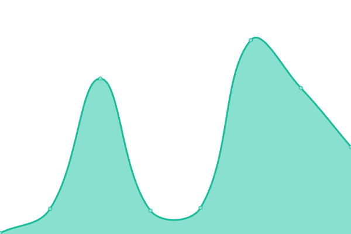
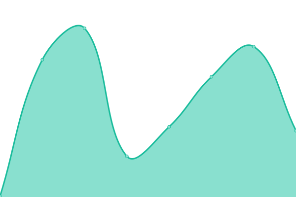
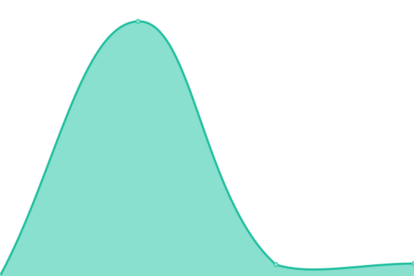
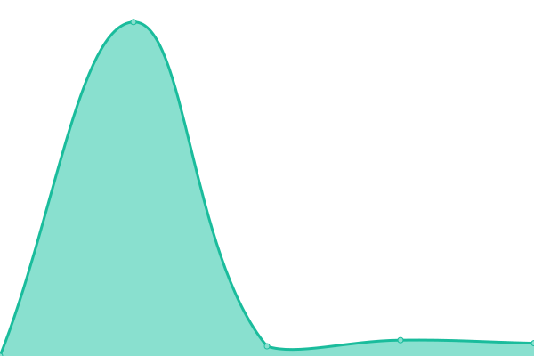

# [📈 Live Status](https://dricottone.github.io/upptime): <!--live status--> **🟩 All systems operational**

This repository contains the open-source uptime monitor and status page for [dricottone](https://git.dominic-ricottone.com), powered by [Upptime](https://github.com/upptime/upptime).

With [Upptime](https://upptime.js.org), you can get your own unlimited and free uptime monitor and status page, powered entirely by a GitHub repository. We use [Issues](https://github.com/dricottone/upptime/issues) as incident reports, [Actions](https://github.com/dricottone/upptime/actions) as uptime monitors, and [Pages](https://dricottone.github.io/upptime) for the status page.

<!--start: status pages-->
<!-- This summary is generated by Upptime (https://github.com/upptime/upptime) -->
<!-- Do not edit this manually, your changes will be overwritten -->
<!-- prettier-ignore -->
| URL | Status | History | Response Time | Uptime |
| --- | ------ | ------- | ------------- | ------ |
|  [Blog](https://www.dominic-ricottone.com) | 🟩 Up | [blog.yml](https://github.com/dricottone/upptime/commits/master/history/blog.yml) | 

 957ms
     
 | 

<a href="https://dricottone.github.io/upptime/history/blog">89.99%</a>
    

|  [Wiki](https://wiki.dominic-ricottone.com) | 🟩 Up | [wiki.yml](https://github.com/dricottone/upptime/commits/master/history/wiki.yml) | 

 230ms
     
 | 

<a href="https://dricottone.github.io/upptime/history/wiki">100.00%</a>
    

|  [Code Repo](https://git.dominic-ricottone.com) | 🟩 Up | [code-repo.yml](https://github.com/dricottone/upptime/commits/master/history/code-repo.yml) | 

 874ms
     
 | 

<a href="https://dricottone.github.io/upptime/history/code-repo">89.99%</a>
    

|  [AWS2](https://aws2.dominic-ricottone.com) | 🟩 Up | [aws-2.yml](https://github.com/dricottone/upptime/commits/master/history/aws-2.yml) | 

 81ms
     
 | 

<a href="https://dricottone.github.io/upptime/history/aws-2">100.00%</a>
    

|  [Placeholder - Go Module Proxy Endpoint](https://go.dominic-ricottone.com) | 🟩 Up | [placeholder-go-module-proxy-endpoint.yml](https://github.com/dricottone/upptime/commits/master/history/placeholder-go-module-proxy-endpoint.yml) | 

 540ms
     
 | 

<a href="https://dricottone.github.io/upptime/history/placeholder-go-module-proxy-endpoint">11.68%</a>
    

|  [Placeholder - VPN Endpoint](https://vpn.dominic-ricottone.com) | 🟩 Up | [placeholder-vpn-endpoint.yml](https://github.com/dricottone/upptime/commits/master/history/placeholder-vpn-endpoint.yml) | 

 1177ms
     
 | 

<a href="https://dricottone.github.io/upptime/history/placeholder-vpn-endpoint">11.68%</a>
    

|  [Placeholder - FTP Endpoint](https://ftp.dominic-ricottone.com) | 🟩 Up | [placeholder-ftp-endpoint.yml](https://github.com/dricottone/upptime/commits/master/history/placeholder-ftp-endpoint.yml) | 

 1178ms
     
 | 

<a href="https://dricottone.github.io/upptime/history/placeholder-ftp-endpoint">11.68%</a>
    

<!--end: status pages-->

[**Visit our status website →**](https://dricottone.github.io/upptime)

## 📄 License

- Powered by: [Upptime](https://github.com/upptime/upptime)
- Code: [MIT](./LICENSE) © [dricottone](https://git.dominic-ricottone.com)
- Data in the `./history` directory: [Open Database License](https://opendatacommons.org/licenses/odbl/1-0/)
